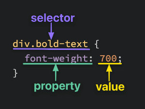
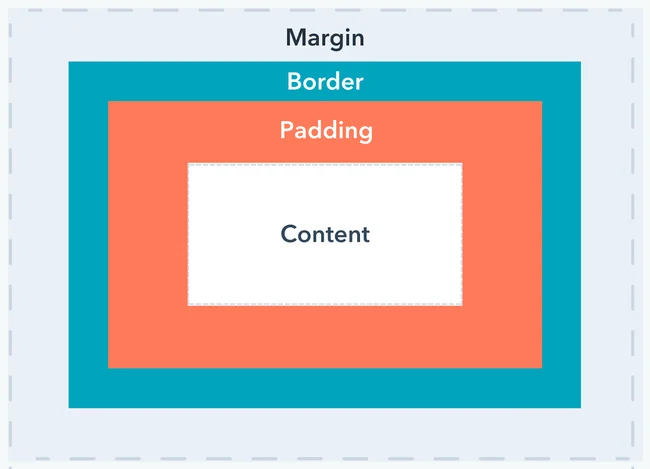

# HTML Overview

---

## Elements and Tags

* Almost all elements on an HTML page are just pieces of content wrapped in opening and closing HTML tags.
* Each tag is enclosed in angle brackets <>

---

A full paragraph element looks like this:
```html
<p>some text content</p>
```

Let’s break this down:
* <p> is the opening tag.
* some text content represents content
* </p> is the closing tag.

---

Some HTML elements do not have a closing tag. These elements often look like this:
```html
<br />

```

---


## HTML Boilerplate

```html
<!DOCTYPE html>
<html lang="en">
  <head>
    <meta charset="UTF-8">
    <title>My First Webpage</title>
  </head>

  <body>
  </body>
</html>
```

---

## Nesting

```html
<body>
    <p>Lorem ipsum dolor sit amet.</p>
    <p>Ut enim ad minim veniam.</p>
</body>
```

* A parent and child relationship between elements
* HTML parent elements can have many children
* Elements at the same level of nesting are siblings

---

## Lists

- Unordered Lists

```html
<ul>
  <li>Item 1</li>
  <li>Item 2</li>
</ul>
```

- Ordered Lists

```html
<ol>
  <li>Item 1</li>
  <li>Item 2</li>
</ol>
```

---

## Links and Images

```html
<a>click me</a>
```

* We use the anchor element
* HTML attribute `href` to actually create link
* Always goes in the element’s opening tag

---

```html
<a href="https://neovim.io">click me</a>
```

* Browser will give the text a blue color and underline it to signify it is a link.
* Set target to blank to open page in a new tab (security problem)

---

## Absolute and Relative Links

* *Absolute links*: Links to pages on other websites on the internet. Made up of the following parts: `protocol://domain/path`

* *Relative links*: Links to other pages within our own website. Do not include protocol and domain name.

---

## Images

```html


```

* `src` attribute can contain absolute and relative links
*  `alt` is used to describe an image if it can't be loaded
* Explicitly set image size with `width` and `height`

---

## Additional Resources

- [Elements](https://developer.mozilla.org/en-US/docs/Web/HTML/Element)
- https://www.youtube.com/watch?v=LGQuIIv2RVA&list=PL4-IK0AVhVjM0xE0K2uZRvsM7LkIhsPT-
- [Links](https://www.youtube.com/watch?v=tsEQgGjSmkM&list=PL4-IK0AVhVjM0xE0K2uZRvsM7LkIhsPT-&index=5)
- [Images](https://www.youtube.com/watch?v=0xoztJCHpbQ&list=PL4-IK0AVhVjM0xE0K2uZRvsM7LkIhsPT-&index=6)
---

## Mini Project

https://tinyurl.com/mtjc5drd

---

# Cascading Style Sheets (CSS)

---

## Basic Syntax



---

## Selectors

- Selectors simply refer to the HTML elements to which CSS rules apply
- They’re what is actually being “selected” for each rule

---

### Universal Selector

```css
* {
  color: purple;
}
```
---

### Type Selector

```html
<!-- index.html -->

<div>Hello, World!</div>
```

```css
/* styles.css */

div {
  color: white;
}
```

---

### Class Selector

```html
<!-- index.html -->

<div class="alert-text">Please agree</div>
```

```css
/* styles.css */

.alert-text {
  color: red;
}
```

--- 

### ID Selector

```html
<!-- index.html -->

<div id="title">My Awesome 90's Page</div>
```

```css
/* styles.css */

#title {
  background-color: red;
}
```

---

### The Grouping Selector

```css
.read,
.unread {
  color: white;
  background-color: black;
}

.read {
  /* several unique declarations */
}

.unread {
  /* several unique declarations */
}
```

---

### Chaining selectors

```html
<div>
  <div class="subsection header">Latest Posts</div>
  <p class="subsection preview">This is a preview.</p>
</div>
```

```css
.subsection.header {
  color: red;
}
```
---

## Basic Syntax


---

## Some Basic Properties

Though this is by no means a complete list. Learning the following properties will simply be enough to help get you started.

---

### Color and background-color

```css
p {
  /* hex example: */
  color: #1100ff;
}

p {
  /* rgb example: */
  background-color: rgb(100, 0, 127);
}

p {
  /* hsl example: */
  color: hsl(15, 82%, 56%);
}
```

---

### Typography basics and text-align

```css
font-family: "Times New Roman", serif;
font-size: 22px;
font-weight: 700; /* equivalent to font-weight: bold */
text-align: center;
```

---

### Image height and width

```css
img {
  height: auto;
  width: 500px;
}
```

---

## Adding CSS to HTML

---

### External CSS

```html
<!-- index.html -->

<head>
  <link rel="stylesheet" href="styles.css" />
</head>
```

---

### Internal CSS

```html
<head>
  <style>
    div {
      color: white;
      background-color: black;
    }

    p {
      color: red;
    }
  </style>
</head>
<body>
  ...
</body>
```

--- 

### Inline CSS

```html
<body>
  <div style="color: white; background-color: black;">...</div>
</body>
```

---

## The Cascade of CSS

---

### Specificity

A CSS declaration that is more specific will take precedence over less specific ones.

1) Inline Styles
2) ID selectors (most specific selector)
3) Class selectors
4) Type selectors

---

```html
<!-- index.html -->

<div class="main">
  <div class="list" id="subsection">Red text on yellow background</div>
</div>
```

```css
/* rule 1 */
#subsection {
  background-color: yellow;
  color: blue;
}

/* rule 2 */
.main #subsection {
 color: red;
}
```

---

### Inheritance

- Certain CSS properties, when applied to an element, are inherited by that element’s descendants
- Typography-based properties (color, font-size, font-family, etc.) are usually inherited, while most other properties aren’t.

--- 

### Rule Order

```css
/* styles.css */

.alert {
  color: red;
}

.warning {
  color: yellow;
}
```

---

## The Box Model



---


---

### Block and Inline

divs are block level elements while spans are inline level elements by default

---

## Additional Resources

- [Mozilla CSS values and units](https://developer.mozilla.org/en-US/docs/Learn/CSS/Building_blocks/Values_and_units)
- [The CSS Cascade](https://wattenberger.com/blog/css-cascade)
- [Box and Inline](https://learnlayout.com/no-layout.html)

---

## Exercises

- [css-methods](https://github.com/Ramanjs/html-css-tutorial/blob/main/css-exercises/01-css-methods/README.md)
- [class-id-selectors](https://github.com/Ramanjs/html-css-tutorial/blob/main/css-exercises/02-class-id-selectors/README.md)
- [group-selectors](https://github.com/Ramanjs/html-css-tutorial/blob/main/css-exercises/03-grouping-selectors/README.md)
- [chaining-selectors](https://github.com/Ramanjs/html-css-tutorial/blob/main/css-exercises/04-chaining-selectors/README.mdj)
- [cascade-fix](https://github.com/Ramanjs/html-css-tutorial/blob/main/css-exercises/05-cascade-fix/README.md)

---

## Project

https://www.dagusa.com

Make this template on your own